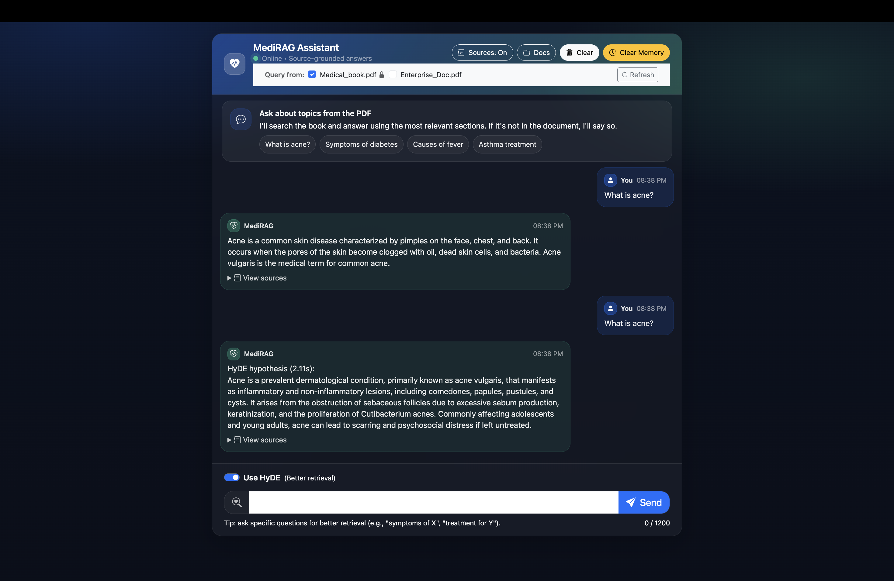

## UI



## Architecture Diagram


# End-End-AdaptiveRAG-GEN-AI


AdaptiveRAG – Document-Grounded Q&A (RAG)

Adaptive (RAG) system that answers questions using PDF documents as the source of truth. The system builds a semantic index using embeddings + Pinecone, retrieves the most relevant chunks for a user query, and generates a concise answer grounded in the retrieved text with citations (doc + page).


### STEP01 Create a conda environment 
``` bash
conda - create -n llmapp python = 3.12-y
```
``` bash
#b

conda activate llmapp
``` 


### STEP02  Install the requirements
``` bash
pip install -r requirement.txt
```


### STEP03 Create .env
``` bash
OPENAI_API_KEY=...
PINECONE_API_KEY=...
PINECONE_INDEX_NAME=medicalbot
```

### STEP04 
```bash
run the command to store embeddings to pinecone
python store_index.py
```

```bash
# Finally run the command
python app.py
```

``` bash
Now, 
open up localhost: 
```

``` bash
Techstack used:
Python
LangChain
Flask
GPT
Pinecone
``` 

### AWS CICD Deployment with Github Actions

``` bash
1. Login to AWS console
```

``` bash
2. Create IAM User for deployment

#with specific access

1. EC2 access : It is virtual machine

2. ECR: Elastic Container registry to save your docker image in aws


#Description: About the deployment

1. Build docker image of the source code

2. Push your docker image to ECR

3. Launch Your EC2 

4. Pull Your image from ECR in EC2

5. Lauch your docker image in EC2

#Policy:

1. AmazonEC2ContainerRegistryFullAccess

2. AmazonEC2FullAccess

```


### 3. Create ECR repo to store/save docker image
 ```bash
 SAVE the URI: 343253677979.dkr.ecr.us-east-1.amazonaws.com/medicalchatbot
 ```


### 4. Create EC2 machine (Ubuntu)


### 5. Open EC2 and Install docker in EC2 Machine:

```bash
#optinal

sudo apt-get update -y

sudo apt-get upgrade

#required

curl -fsSL https://get.docker.com -o get-docker.sh

sudo sh get-docker.sh

sudo usermod -aG docker ubuntu

newgrp docker

```

### 6.Configure EC2 as self-hosted runner:
``` bash
setting>actions>runner>new self hosted runner> choose os> then run command one by one
```

### 7. Setup github secrets:
- AWS_ACCESS_KEY_ID
- AWS_SECRET_ACCESS_KEY
- AWS_DEFAULT_REGION
- ECR_REPO
- PINECONE_API_KEY
- OPENAI_API_KEY


